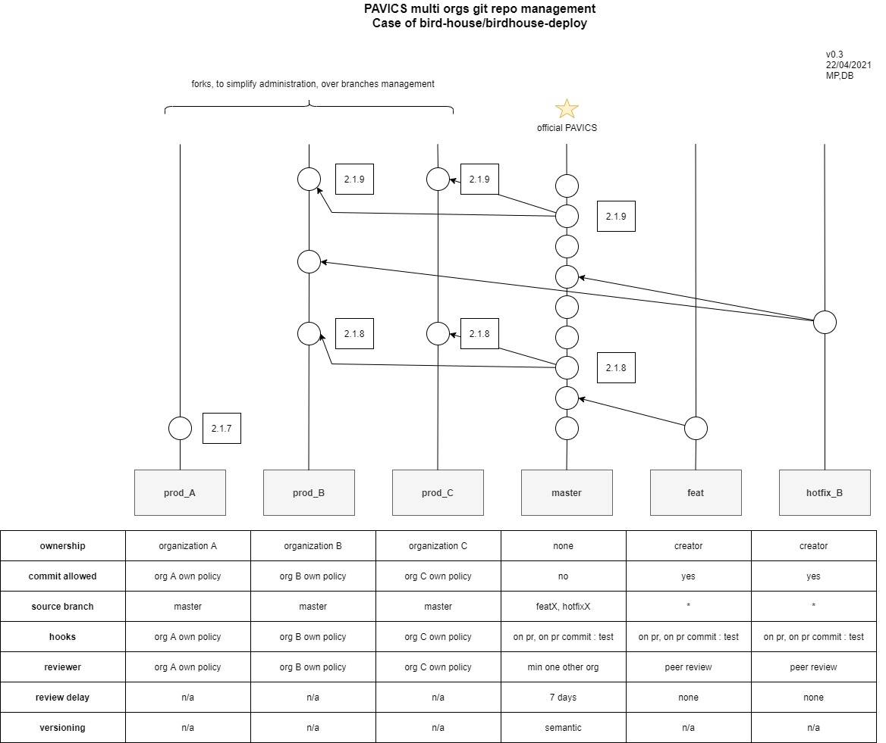

# Contributing

Contributions are welcome, and they are greatly appreciated! Every little bit helps, and credit will always be given.

Please read the PAVICS [Developer Documentation](https://pavics-sdi.readthedocs.io/en/latest/dev/index.html) to get started.

## Policy
Since PAVICS is used in production by multiple organizations, this deployment repository also has a policy regarding contributions. 

### Policy objectives:
1. Keep production stable between deployments
2. Encourage PR to be merged more quickly
3. Achieve the two previous objectives 
      * by weighing down everyone's workflow as little as possible
      * by having an approach that scales well as more nodes go into production and the number of PR increases

### Policy rules:
1. The repository has a main branch, "master", open to the community where contributions, "PR", are welcome. This master branch must not have owners and therefore no organization can block contributions to it.
2. Contributions should be backward-compatible whenever possible, or feature a toggle switch so that organizations can activate the new feature on their own schedule.
3. Contributions will trigger a test suite that must successfully pass before being reviewed.
4. Contributions must be reviewed by at least one organization and possibly more than one organization depending on the impact of the contribution.
5. The reviews must be rigorous while respecting the initial scope.
6. Each organization wishing to review the changes has the duty to do so within a reasonable period of time (7 days) or to indicate its intention to do so later with reasonable reasons (e.g., vacation). After this time, its implicit support will be considered. It will be assumed that the organization agrees to the changes, and they will get merged without further notice.
7. Each organization maintains a fork for its production allowing it to deploy the platform at its own pace. It also allows to self-manage the production fork contribution permissions and develop feature branches.
8. Each organization is responsible for keeping its production fork up to date with the main branch to avoid discrepancies.
9. If patches or contributions are made directly in the production fork, they must also be ported and approved in the main branch (no code that does not exist in the main branch should exist in a production fork).
10. The main branch will contain the official versions of PAVICS that will evolve according to semantic versioning. These versions should be used by the organizations.
11. If contributions are made directly in a production fork (point 9), a tagged version should use the last common one with the main branch but also include a suffix. 
    * Example: The main branch is at 2.1.8, and a contribution is made in a production fork from 2.1.8. The tag 2.1.9 cannot be applied because this version could possibly exists in the main branch. A tag looking like 2.1.8.orgXrev1 would be preferred.
    
